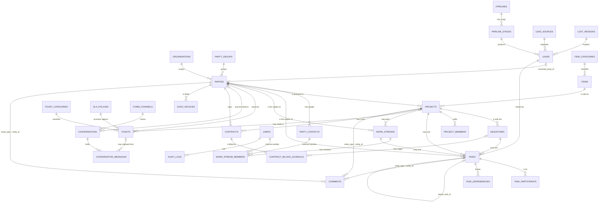

# CRM

The CRM layer is HQ's spine: the customers, the pipeline, the catalogue, the
delivery board, the daily task list, the helpdesk, the message threads and the
contracts, all in one schema with one change history. It replaces the Notion
delivery board, the 00-Brain "Work" pages and Google Tasks, and it is designed to
be driven by an agent as easily as by a browser.

It is built on one idea: **one declarative registry describes every entity, and
the API, the UI, the CLI and the permission catalogue all render from it.**
Nothing about an entity is written three times, so the surfaces cannot drift
apart — and a new entity is covered by authorisation the moment it exists,
rather than being accidentally left open.

## What it holds

Twenty-five entities across six workspaces, published live at
`GET /api/meta/entities` (`"count": 25`). They sit on 24 tables: `services` and
`catalog-products` are one table shown twice.

**CRM** — who we sell to, and what we are delivering.

| Registry key | Table | What it is for |
|---|---|---|
| `customers` | `parties` | The master record for any external party. Customers, prospects and vendors are one table split by `kind`, never three. |
| `contacts` | `party_contacts` | A person. `party_id` is nullable, so an advisor or intermediary who belongs to no company still has a home. |
| `leads` | `leads` | A prospect before they are a customer. Converts into a `parties` row. |
| `services` | `items` (`item_type='service'`) | The services ZeroOne sells. |
| `catalog-products` | `items` (`item_type='goods'`) | Physical/licensed goods. Same table as services, split by scope. |
| `projects` | `projects` | Delivery. Mirrors the live board: `<Customer> — <Service>`, a stage, a next action, money. |
| `milestones` | `milestones` | Dated, priced chunks of a project. |
| `project-members` | `project_members` | Who is on a project, and at what allocation. |

**Config** — the CRM's own setup. Kept out of the business workspaces so a role
can be given the records without being given the shape of the system.

| Registry key | Table | What it is for |
|---|---|---|
| `party-groups` | `party_groups` | Segmentation buckets — "Water Treatment", "Transformers". |
| `lead-sources` | `lead_sources` | Where a lead came from. |
| `pipelines` | `pipelines` | A named funnel. One (`Sales`) is seeded and marked default. |
| `pipeline-stages` | `pipeline_stages` | The rungs of a funnel, with `probability`, `is_won`, `is_lost`. |
| `lost-reasons` | `lost_reasons` | Why a lead was lost. |
| `item-categories` | `item_categories` | Catalogue tree, `kind` = service or product. |

**Work** — where the day actually happens.

| Registry key | Table | What it is for |
|---|---|---|
| `tasks` | `tasks` | The Google Tasks replacement. Project is optional — see below. |
| `work-streams` | `work_streams` | A standing stream of work keyed by the people in it ("Meet x Nishant"). |
| `work-stream-members` | `work_stream_members` | Members of a stream — a platform user **or** an external contact. |

**Tickets** — the helpdesk. What a client has asked us to fix, and by when.

| Registry key | Table | What it is for |
|---|---|---|
| `tickets` | `tickets` | A client complaint or request, with its SLA timestamp trail. `status` and `assigned_to` are orthogonal on purpose: a ticket can be assigned and still new, or unassigned and already resolved. |
| `job-types` | `ticket_categories` | The kind of request — Bug, Change request, Onboarding, Data fix. Labelled "Job types" in the UI; the table keeps the module registry's name. Carries a `default_priority`, and nests through `parent_id`. |
| `sla-policies` | `sla_policies` | Response and resolution targets per priority, held as JSON in `targets`. One may be `is_default`. |

**Comms** — message threads. Read "Not built yet" before assuming anything
arrives here on its own. Nothing does.

| Registry key | Table | What it is for |
|---|---|---|
| `conversations` | `conversations` | One thread per counterparty per channel. That triple is a unique constraint, so the same person on the same channel is one row and not many. |
| `channels` | `comm_channels` | A connected endpoint: a WhatsApp number, a mailbox, an SMS sender. Non-secret settings only — credentials are deliberately not stored here. |

**Accounting** — what was agreed, what is billable, and what Zoho Books says is
owed. HQ plans the money; it never raises it. See "Zoho Books owns the money".

| Registry key | Table | What it is for |
|---|---|---|
| `contracts` | `contracts` | The signed-agreement vault: MSA, SOW, retainer, AMC, NDA, with value, renewal date and notice period. |
| `billing-schedule` | `contract_billing_schedule` | When a contract becomes an invoice. A line stays `pending` until the invoice exists in Zoho Books, at which point `zoho_invoice_number` and `invoiced_on` are stamped on it. |
| `invoices` | `zoho_invoices` | **Read-only.** A mirror of Zoho Books. `POST`, `PATCH` and `DELETE` return `405`; the registry entry carries `"read_only": true` and an empty `fields[]`. |

Tables that exist in `backend/crm_models.py` but have **no** registry entry, and
therefore no generic REST route:

| Table | Status |
|---|---|
| `comments` | Reachable, but only through the remark routes (`/api/{key}/{id}/remarks`). Deliberate: remarks are append-only, so they must not get generic PATCH/DELETE. |
| `audit_logs` | Reachable read-only through `GET /api/audit`. |
| `conversation_messages` | **Not reachable at all.** It is the only store of what a client actually said, and it has no route, no writer and no ingestion. See "Not built yet". |
| `activities`, `attachments`, `task_participants`, `task_dependencies`, `saved_views`, `terminology_overrides` | Tables only. `GET /api/activities` returns `404 Unknown entity 'activities'` today. They are modelled, not exposed. |

Saved views are currently served from the registry (`saved_views` in each entity
entry), not from the `saved_views` table. The table is there for per-user views
later; nothing writes to it yet.

## The core design decision

`backend/registry.py` is the contract. Everything else is a consumer of it:

* `backend/crud.py` generates the six REST routes plus the remark routes for
  every entry.
* `GET /api/meta/entities` publishes the registry, minus the SQLAlchemy model
  class.
* `frontend/static/PortalPage.dc.html` builds every list, form and detail page
  from it, and hides what the caller's `can` block forbids. The file says so
  outright: *"This page renders from /api/meta/entities, not from a hardcoded
  tab list."*
* `cli/hq-cli.py` builds `ls / get / create / update / delete / remark /
  remarks / describe` from it at runtime, with no entity name hardcoded.
* `backend/permissions.py` derives the permission catalogue from it —
  `<key>:<action>` for every registry key — so a new entity is protected
  automatically instead of shipping unguarded. See "Who can do what".
* `GET /api/catalog` generates its per-entity half from it
  (`crud.catalog_entries()`), so the published endpoint list cannot fall behind
  the routes. On this build, 220 endpoints: 45 hand-written for the bespoke
  platform routes, 175 generated.

So adding an entity is **one registry entry**. No router, no form, no CLI
command, no nav item, no permission rows, no catalogue entry.

### Worked example: exposing `activities`

`activities` is a real table in `backend/crm_models.py` — calls, meetings,
emails and WhatsApp logged against any record — and it is currently invisible:

```
$ curl -s -H "Authorization: Bearer $TOKEN" http://127.0.0.1:8077/api/activities
{"detail":"Unknown entity 'activities'"}   # HTTP 404
```

Exposing it is this, appended to `backend/registry.py`, and nothing else:

```python
entity(
    key="activities",
    entity_type="activities",
    model=m.Activity,
    label="Activity",
    plural="Activities",
    workspace="CRM",
    module="Customers",
    icon="activity",
    accent="#A2D2FF",
    order_by="-occurred_at",
    search=["subject", "body", "outcome"],
    title_field="subject",
    columns=[
        {"k": "subject", "label": "Subject", "type": "text", "width": "2.4fr", "primary": True},
        {"k": "activity_type", "label": "Type", "type": "badge", "width": "1fr"},
        {"k": "party_id", "label": "Customer", "type": "ref", "ref": "customers", "width": "1.6fr"},
        {"k": "owner_id", "label": "Owner", "type": "ref", "ref": "users", "width": "1.2fr"},
        {"k": "occurred_at", "label": "When", "type": "datetime", "width": "1.2fr"},
    ],
    fields=[
        {"k": "subject", "label": "Subject", "type": "text", "required": True, "group": "Activity"},
        {"k": "activity_type", "label": "Type", "type": "select",
         "options": ["call", "meeting", "email", "whatsapp", "note"], "default": "note", "group": "Activity"},
        {"k": "body", "label": "Detail", "type": "textarea", "group": "Activity"},
        {"k": "party_id", "label": "Customer", "type": "ref", "ref": "customers", "group": "Context"},
        {"k": "owner_id", "label": "Owner", "type": "ref", "ref": "users", "group": "Context"},
        {"k": "occurred_at", "label": "Occurred at", "type": "datetime", "group": "Context"},
        {"k": "duration_minutes", "label": "Duration (min)", "type": "number", "group": "Context"},
        {"k": "outcome", "label": "Outcome", "type": "text", "group": "Context"},
    ],
    key_facts=["party_id", "owner_id", "activity_type", "occurred_at"],
    saved_views=[
        {"name": "All", "filters": {}},
        {"name": "Mine", "filters": {"owner_id": "me"}},
    ],
)
```

That entry alone yields, on the next boot:

* `GET/POST /api/activities`, `GET/PATCH/DELETE /api/activities/{id}`,
  `GET/POST /api/activities/{id}/remarks`
* an Activities tab under CRM → Customers in the SPA, with that column layout,
  that form grouped into Activity/Context, and those saved views
* `hq-cli activities ls`, `... get`, `... create --set subject=…`, `... describe`
* an audit entry on every write, with `entity_type="activities"`
* five permission codes (`activities:read` … `activities:remark`), granted to
  the roles whose wildcards already cover them, and enforced on those routes
* seven more entries in `GET /api/catalog`

Two boot-time guards keep the registry honest, both in `backend/crud.py`:

* `validate_registry()` — every `fields`/`columns`/`key_facts`/`search`/`scope`
  key must be a real column on the model, and every `ref` must name a real
  registry key. A typo would otherwise be silently dropped on write: the user
  fills the form and the value vanishes with no error. It raises at startup
  instead.
* `check_route_collisions(app)` — `/api/{key}` is registered last as a
  catch-all, so a registry key matching an earlier literal route would silently
  serve the wrong rows. This is why the catalogue's product entity is keyed
  `catalog-products`: `/api/products` is already the platform's own
  product-config route.

## The data model



Read it as seven clusters that meet at `parties`:

1. **Who** — `parties` + `party_contacts` + `party_groups`. Every other cluster
   points here; none of them keeps its own copy of a customer.
2. **Pipeline** — `leads` sitting on a `pipeline_stages` rung, with a `source`
   and, if it dies, a `lost_reason`. Conversion writes a `parties` row.
3. **Delivery** — `projects` (a customer × a catalogue item), split into
   `milestones`, staffed by `project_members`.
4. **Work** — `tasks` and `work_streams`. This is where the day actually
   happens, and it is deliberately the loosest-coupled cluster.
5. **Helpdesk** — `tickets` classified by a `ticket_categories` row and timed
   against an `sla_policies` row. A ticket may hang off a project, but does not
   have to: not every complaint is about something we are mid-delivery on.
6. **Messages** — `comm_channels` → `conversations` → `conversation_messages`.
   `conversation_messages` is the single store of external message text;
   `tickets` reference a message rather than copying the reply into their own
   table, because a standing thread outlives any one ticket. Nothing populates
   these tables today.
7. **Money** — `contracts` and their `contract_billing_schedule`, plus
   `zoho_invoices`. HQ records what was agreed and what is due to be billed;
   Zoho Books raises the invoice. A schedule line records only that it was
   billed and which Zoho document carries it.

`comments` (remarks) and `audit_logs` are polymorphic — `entity_type` +
`entity_id` — so any record in any cluster gets the same history mechanism
without each module re-implementing one.

### Why `tasks.project_id` is nullable

Because most daily work is not project work. From `backend/crm_models.py`:

> `project_id` is nullable on purpose: most of Meet's daily tasks belong to a
> person or a work stream, not a delivery project. A task that required a
> project would push half the real workload back out to Google Tasks.

A task can hang off any of `project_id`, `milestone_id`, `work_stream_id`,
`party_id`, `lead_id`, `parent_task_id` — **all nullable, none required**. The
only required field on a task is `title`. Verified: creating a task with just a
title and a customer returns `"project_id": null` and a `200`.

The practical consequence is that "Chase Nishant about the contract" and
"Deploy AquaServe for Om Enterprises" live in the same list, which is the whole
point of replacing Google Tasks rather than sitting alongside it.

### Leads: the funnel and what conversion does

A lead carries two orthogonal position markers, and conflating them is the
usual CRM mistake:

* **`stage_id`** — where it sits *inside* the funnel. The seeded `Sales`
  pipeline has seven rungs: New (10%), Qualified (25%), Demo done (45%),
  Proposal sent (65%), Negotiation (80%), Won (100%, `is_won`), Lost (0%,
  `is_lost`).
* **`status`** — the funnel *outcome*: `open`, `won`, `lost`. The registry
  marks this with `"readonly_hint": "Use Convert to mark a lead won."`

`POST /api/leads/{id}/convert` does five things, in one transaction:

1. Creates a `parties` row (`kind` defaults to `customer`) carrying the lead's
   `phone`, `email`, `owner_id` and `notes` (as the party `summary`). The name
   is `display_name` from the payload, else `company_name`, else `title`.
2. Creates a `party_contacts` row from `contact_name`, marked `is_primary`, if
   the lead had one.
3. Stamps `converted_party_id` and `converted_at` on the lead.
4. Sets the lead's `status` to `won`.
5. Writes two audit entries — a `convert` on the lead and a `create` on the
   party, cross-referencing each other.

**The lead is kept, never deleted.** The funnel history is the reason the lead
existed; deleting it on success would throw away the only record of how the
customer was won.

Two guards:

* Converting twice returns the existing customer with
  `"already_converted": true`. Safe to retry.
* If a customer with that `display_name` already exists in the organisation,
  conversion is refused with **409**, not silently merged. Merging into the
  wrong company is worse than an error.

### Work streams

A work stream is the 00-Brain "Work" join: a standing stream keyed by the people
in it, as opposed to a dated task or a delivery project. Two are seeded, "Meet x
Nishant" and "Meet x Hemish". `work_stream_members` accepts either a platform
`user_id` or an external `party_contact_id`, so a stream can span both sides of
a relationship. `waiting_on_id` records whose court the ball is in.

## Who can do what

Authorisation is enforced, in `backend/permissions.py`. A permission is the
string `<entity>:<action>`; a role holds a set of them; every registry route and
every hand-written platform route checks one before it runs.

The permission codes are **derived from the registry**, not listed by hand:
`entity_keys()` is every registry key plus eight platform surfaces (`users`,
`roles`, `permissions`, `organisations`, `products`, `workspaces`, `feedback`,
`audit`), crossed with five actions — `read`, `create`, `update`, `delete`,
`remark`. That is 165 codes on this build. The point of deriving them is that a
new entity arrives already protected; a hand-maintained list would have left it
open until someone remembered.

Two design choices worth stating plainly:

* **`remark` is separate from `update`.** An advisor should be able to add to a
  record's history without being able to alter the record. Splitting the two is
  what makes "read-only, but can comment" a real role rather than a compromise.
* **Read is generous, delete is not.** Nishant and Hemish are meant to see
  everything, so every role above Viewer reads everything. Deletion is the one
  irreversible action, and an advisor holding it was a hole, not a feature.
  Only Admin and Partner can delete.

Grants are wildcard patterns (`*:read`, `customers:*`, `*:*`), so a role reads
as a short reviewable list instead of a hundred rows. There are no deny rules —
absence is denial.

Roles the platform defines take their grants from **code**, not from the
`role_permissions` rows: `permissions_for()` looks the role name up in `ROLES`
and expands the patterns. A grant change therefore ships with a deploy rather
than needing a data migration. A hand-made role that is not in `ROLES` falls
back to whatever permission rows are linked to it.

The matrix, and the 403 an agent will actually see, are in `docs/API.md`.

## Zoho Books owns the money

Zoho Books (organisation `60078183686`, India DC) is the system of record for
every rupee ZeroOne bills. HQ deliberately does not take that job on.

**HQ never raises or edits an invoice.** `backend/zoho.py` contains no create,
update or delete call and must never contain one: two systems both claiming to
author an invoice is how a numbering series and a GST return drift apart, and
the series in Zoho is the one the tax office sees. That is why the `invoices`
entity is `read_only` in the registry and returns `405` on every write, and why
the OAuth scope below is read-only — the credential itself should be incapable
of a write, not merely unused by today's code.

What HQ keeps is the *plan* and the *mirror*: `contracts` and
`contract_billing_schedule` record what was agreed and what falls due;
`zoho_invoices` and `parties.outstanding_amount` mirror what Zoho says exists,
so a customer page can show what is owed without a second tab.

### Configuring it

Five environment variables, of which three are secrets and two default:

| Variable | Required | Default |
|---|---|---|
| `ZOHO_CLIENT_ID` | yes | — |
| `ZOHO_CLIENT_SECRET` | yes | — |
| `ZOHO_REFRESH_TOKEN` | yes | — |
| `ZOHO_ORG_ID` | no | `60078183686` |
| `ZOHO_DC` | no | `in` (→ `accounts.zoho.in`, `www.zohoapis.in`) |

With none of them set the app boots exactly as before and `zoho.status()`
reports `"not configured"`. Nothing about Zoho is on the boot path. Setting them
is also not enough to make anything happen — see "Not built yet": no route or
job calls this client yet.

The scope to request, from `api-console.zoho.in` → Self Client → Generate Code:

```
ZohoBooks.contacts.READ,ZohoBooks.invoices.READ,ZohoBooks.settings.READ
```

Two traps, both worth spelling out because both are easy to get wrong:

* **`ZohoBooks.fullaccess.READ` does not exist.** Zoho's scope format is
  `ZohoBooks.<module>.<CREATE|READ|UPDATE|DELETE|ALL>`; there is no
  `fullaccess.READ` variant. Asking for it fails.
* **`ZohoBooks.fullaccess.all` grants writes.** It is the obvious thing to reach
  for when a scope is rejected, and it hands HQ the ability to alter the books.
  Do not use it. (Both verified against the Zoho Books v3 OAuth documentation on
  2026-07-26; the note is in `backend/zoho.py`.)

Exchange the grant code — valid for minutes, not days — for a refresh token by
POSTing `grant_type=authorization_code` with the client id, secret and code to
`https://accounts.zoho.in/oauth/v2/token`. The `refresh_token` in that response
is the long-lived one HQ needs.

### The names do not match, and no algorithm will fix that

Zoho Books and HQ call the same customer different things, because Zoho holds
the legal entity and HQ holds the person Meet actually deals with:

| In Zoho Books | In HQ |
|---|---|
| `GOA TRADING & TECHNICAL SERVICES` | Michael Bhai |
| `KAJAL PARAG TELI` | Parag Kaka |

No amount of string cleverness derives one from the other. `match_contacts()` in
`backend/zoho.py` therefore **proposes and never applies**. It normalises names
(dropping legal tokens like `LLP`, `Private`, `Limited`, so `NEO NIR ENGINEERING
LLP` meets `NeoNir Engineering`), scores word overlap, and returns at most one
proposal per Zoho contact and per HQ customer, each with a confidence and a
one-line reason a human can check in a second.

Confidence means something specific:

* **`exact`** is reserved for a match on a **unique identifier — an email
  address — and is never awarded on a name, however identical.** Two unrelated
  firms sharing a name is a thing that happens, and in an accounting-adjacent
  join that mistake attaches the wrong receivable to the wrong customer.
* **`likely`** is a normalised-name equality, a trailing-descriptor prefix, or
  ≥75% shared significant words.
* **`weak`** is 40–75% shared words. It exists to give a human a shortlist.

**No proposal is auto-applied, and a weak one least of all.** The two rows above
sat in `ZOHO_LIKELY_MATCHES` unlinked until Meet confirmed both on 2026-07-26;
they are now ordinary entries in `ZOHO_LINKS`. That is the whole lifecycle — a
name-only match waits in `ZOHO_LIKELY_MATCHES` for a human, and moves across
once answered. Linking `KAJAL PARAG TELI` to Parag Kaka closes the ₹11,800
difference between HQ's ₹5.31L and Zoho's ₹5.43L.

## Deviations from the Super-App module registry

Table and column names follow the Super-App module registry (`parties`, `items`,
`projects`, `milestones`, `tasks`, `leads`, `tickets`, `ticket_categories`,
`sla_policies`, `conversations`, `conversation_messages`, …) so nothing here is
an invented entity. Three deliberate deviations, documented here rather than
left silent — all are **amendments to the registry, not compliance with it**:

**1. `organisation_id`, not `org_id`.** The Super-App registry scopes rows with
`org_id`. This codebase already scoped with `organisation_id` before the CRM
layer existed (`users`, `products`, `workspaces`, `roles`). One schema carrying
two spellings of the same foreign key is worse than one consistent spelling, so
every CRM table uses `organisation_id`. If the Super-App registry is ever the
source of truth for a generator, this is the one rename it has to apply.

**2. `work_streams` / `work_stream_members` have no registry equivalent.** They
model the 00-Brain "Work" join — a standing stream of work keyed by a set of
people. The registry has no table for that shape. Rather than bend an existing
module out of shape (a helpdesk ticket, a long-running project, a task with
children), they are added as new tables and flagged as a registry amendment. If
you are diffing HQ's schema against the module registry, these are expected
extras, not drift.

**3. `contracts` / `contract_billing_schedule` have no registry equivalent
either** (PRD §3.5). The signed-agreement vault and its billing schedule are new
tables. They were kept separate from `zoho_invoices` on purpose: a schedule line
is HQ's *plan* to bill, the invoice is Zoho's *fact* of having billed, and
collapsing the two would put HQ in the business of authoring invoices. A
schedule line records only that it was billed and which Zoho document carries
it.

## Provenance and history

Every business table carries `created_at`, `updated_at`, `created_by_id`,
`updated_by_id`, so no row is anonymous or undated. `tasks` and `comments` also
carry `source` (`ui|api|cli|agent|import`), stamped from the `X-HQ-Client`
header, so an agent's write is distinguishable from one a human typed.

On top of that:

* **`audit_logs`** records every create, update, delete, convert, remark, login
  and failed login, with a field-level `{field: {from, to}}` diff on updates and
  the row's final state on deletes. The actor's email is denormalised onto the
  row so the trail survives the user being deleted.
* **`comments`** is the append-only remark history. There is deliberately no
  edit or delete route — `PATCH` and `DELETE` on `/api/{key}/{id}/remarks`
  return `405`. A correction is a new remark.

## Not built yet

Tickets, Communication and Accounting now have tables, registry entries and the
full set of REST routes. That is not the same as being finished, and the gap
matters most in Communication. Be exact with yourself and with any agent:

**Communication now sends and receives, and the limits are specific.**
`POST /api/comms/inbound` lands a message; `POST /api/conversations/{id}/messages`
sends one through the WhatsApp bot at `wa.dotsai.cloud`. What to be exact about:

* **Only WhatsApp actually sends.** Email and SMS channels record an outbound
  message and deliver nothing. The stored `delivery_status` says which happened —
  `sent`, `failed`, or `recorded` — and `GET .../thread` returns
  `sending_enabled` so the composer offers *Send* only where it is true. Never
  read a row's existence as proof the client received it.
* **Inbound needs the bot configured to forward.** HQ's endpoint is ready and
  fails closed without `COMMS_WEBHOOK_TOKEN`; the forwarding itself lives in
  `services/whatsapp-bot/src/hq-ingest.js` in the *meet-workstyle* repo and is a
  no-op unless `HQ_INGEST_URL` and `HQ_INGEST_TOKEN` are set on that container.
  The generic `WHATSAPP_WEBHOOK_URL` is not it — that one points at wa-brain and
  carries no credential.
* **Production keeps only known senders.** `COMMS_KNOWN_SENDERS_ONLY=true`
  because the carrier is a number that is also a personal phone and this inbox is
  read by the whole team. A stranger's message is dropped, not threaded, and the
  endpoint answers `{"ignored": true}`. Off by default — see `comms.known_senders_only`.
* **Numbers are stored as ten digits** (`comms._digits`), which is what makes one
  person match across three systems and is *not* dialable. `whatsapp.dial_address`
  rebuilds the full number from the linked contact and declines to send rather
  than guess a country code.
* **Media is a placeholder.** An image or document arrives as `[image received]`;
  the bytes stay on the bot behind its own auth and HQ does not fetch them.

**Zoho Books is a client, not a running sync.** `backend/zoho.py` is complete
and tested (`tests/zoho_client_test.py`), but nothing in the application imports
it: no route, no scheduled job, no CLI command. The only importer is its own test
suite. The Zoho figures visible today — `parties.outstanding_amount`,
`zoho_contact_name` — were written by `backend/seed_crm.py` from a manual read
taken on 2026-07-26, and nothing populates `zoho_invoices` at all. Wiring
`list_contacts()` / `list_invoices()` to something that runs is outstanding work.

**Tickets have no SLA clock.** `sla_policies.targets` holds the promise, and
`tickets` carries `first_response_due_at` and `resolution_due_at`, but nothing
computes one from the other: no code anywhere reads `targets`. The two breach
booleans (`response_sla_breached`, `resolution_sla_breached`) are columns with
no registry field, so they cannot even be set through the API. The Tickets
dashboard derives "Breaching SLA" by comparing `resolution_due_at` to now, which
makes it only as good as whatever set that column by hand.

Still modelled and still not exposed: `activities`, `attachments`,
`task_participants`, `task_dependencies`, per-user `saved_views` and
`terminology_overrides`. The tables exist; nothing reads or writes them through
the API.

## Dashboards

`GET /api/dashboard/stats?workspace=…` returns six tiles per workspace, and
`GET /api/dashboard/trend?workspace=…` the six-month cumulative growth of that
workspace's primary record. Accepted values: `crm`, `work`, `tickets`, `comms`
(or `communication`), `accounting`, `hq`. An unrecognised value falls back to
the `hq` platform view rather than erroring.

Every workspace used to render the same six numbers — users, roles, permissions,
organisations, products, workspaces. On a CRM dashboard that is worse than an
empty page: it looks like information while answering nothing anyone opened the
page to ask. Each workspace now answers its own question — CRM: who are our
customers and what is in flight; Work: what is on me today and what has slipped;
Tickets: what is waiting on us and what is breaching; Comms: who is waiting for
a reply; Accounting: what is owed and what is billable but unbilled.

**A dashboard aggregates and owns nothing.** Every figure is a count or a sum
over a table another workspace writes, so a tile can never diverge from the list
it summarises. There is no dashboard table and no cache.

## See also

* `docs/API.md` — the REST reference, with real captured responses, and the
  authorisation matrix.
* `docs/AGENTS.md` — how an agent should drive this platform.
* `docs/DATABASE.md` — where the data physically lives and how it is deployed.
* `tests/api_smoke.py` — the executable version of the contract. If this doc and
  that file disagree, the file is right.
