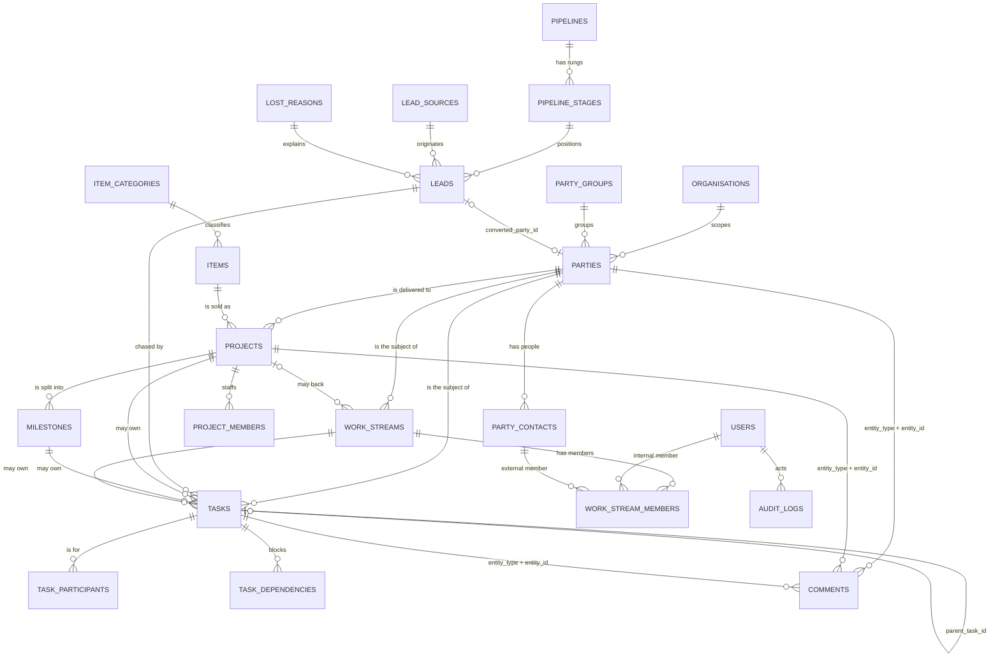

# CRM

The CRM layer is HQ's spine: the customers, the pipeline, the catalogue, the
delivery board, and the daily task list, all in one schema with one change
history. It replaces the Notion delivery board, the 00-Brain "Work" pages and
Google Tasks, and it is designed to be driven by an agent as easily as by a
browser.

It is built on one idea: **one declarative registry describes every entity, and
the API, the UI and the CLI all render from it.** Nothing about an entity is
written three times, so the three surfaces cannot drift apart.

## What it holds

Seventeen entities, published live at `GET /api/meta/entities`.

| Registry key | Table | What it is for |
|---|---|---|
| `customers` | `parties` | The master record for any external party. Customers, prospects and vendors are one table split by `kind`, never three. |
| `contacts` | `party_contacts` | A person. `party_id` is nullable, so an advisor or intermediary who belongs to no company still has a home. |
| `party-groups` | `party_groups` | Segmentation buckets — "Water Treatment", "Transformers". |
| `leads` | `leads` | A prospect before they are a customer. Converts into a `parties` row. |
| `lead-sources` | `lead_sources` | Where a lead came from. Config. |
| `pipelines` | `pipelines` | A named funnel. One (`Sales`) is seeded and marked default. |
| `pipeline-stages` | `pipeline_stages` | The rungs of a funnel, with `probability`, `is_won`, `is_lost`. |
| `lost-reasons` | `lost_reasons` | Why a lead was lost. Config. |
| `services` | `items` (`item_type='service'`) | The services ZeroOne sells. |
| `catalog-products` | `items` (`item_type='goods'`) | Physical/licensed goods. Same table as services, split by scope. |
| `item-categories` | `item_categories` | Catalogue tree, `kind` = service or product. |
| `projects` | `projects` | Delivery. Mirrors the live board: `<Customer> — <Service>`, a stage, a next action, money. |
| `milestones` | `milestones` | Dated, priced chunks of a project. |
| `project-members` | `project_members` | Who is on a project, and at what allocation. |
| `tasks` | `tasks` | The Google Tasks replacement. Project is optional — see below. |
| `work-streams` | `work_streams` | A standing stream of work keyed by the people in it ("Meet x Nishant"). |
| `work-stream-members` | `work_stream_members` | Members of a stream — a platform user **or** an external contact. |

Tables that exist in `backend/crm_models.py` but have **no** registry entry, and
therefore no generic REST route:

| Table | Status |
|---|---|
| `comments` | Reachable, but only through the remark routes (`/api/{key}/{id}/remarks`). Deliberate: remarks are append-only, so they must not get generic PATCH/DELETE. |
| `audit_logs` | Reachable read-only through `GET /api/audit`. |
| `activities`, `attachments`, `task_participants`, `task_dependencies`, `saved_views`, `terminology_overrides` | Tables only. `GET /api/activities` returns `404 Unknown entity 'activities'` today. They are modelled, not exposed. |

Saved views are currently served from the registry (`saved_views` in each entity
entry), not from the `saved_views` table. The table is there for per-user views
later; nothing writes to it yet.

## The core design decision

`backend/registry.py` is the contract. Everything else is a consumer of it:

* `backend/crud.py` generates the six REST routes plus the remark routes for
  every entry.
* `GET /api/meta/entities` publishes the registry, minus the SQLAlchemy model
  class.
* `frontend/static/PortalPage.dc.html` builds every list, form and detail page
  from it — line 349 of that file says so outright: *"This page renders from
  /api/meta/entities, not from a hardcoded tab list."*
* `cli/hq-cli.py` builds `ls / get / create / update / delete / remark /
  remarks / describe` from it at runtime, with no entity name hardcoded.

So adding an entity is **one registry entry**. No router, no form, no CLI
command, no nav item.

### Worked example: exposing `activities`

`activities` is a real table in `backend/crm_models.py` — calls, meetings,
emails and WhatsApp logged against any record — and it is currently invisible:

```
$ curl -s -H "Authorization: Bearer $TOKEN" http://127.0.0.1:8077/api/activities
{"detail":"Unknown entity 'activities'"}   # HTTP 404
```

Exposing it is this, appended to `backend/registry.py`, and nothing else:

```python
entity(
    key="activities",
    entity_type="activities",
    model=m.Activity,
    label="Activity",
    plural="Activities",
    workspace="CRM",
    module="Customers",
    icon="activity",
    accent="#A2D2FF",
    order_by="-occurred_at",
    search=["subject", "body", "outcome"],
    title_field="subject",
    columns=[
        {"k": "subject", "label": "Subject", "type": "text", "width": "2.4fr", "primary": True},
        {"k": "activity_type", "label": "Type", "type": "badge", "width": "1fr"},
        {"k": "party_id", "label": "Customer", "type": "ref", "ref": "customers", "width": "1.6fr"},
        {"k": "owner_id", "label": "Owner", "type": "ref", "ref": "users", "width": "1.2fr"},
        {"k": "occurred_at", "label": "When", "type": "datetime", "width": "1.2fr"},
    ],
    fields=[
        {"k": "subject", "label": "Subject", "type": "text", "required": True, "group": "Activity"},
        {"k": "activity_type", "label": "Type", "type": "select",
         "options": ["call", "meeting", "email", "whatsapp", "note"], "default": "note", "group": "Activity"},
        {"k": "body", "label": "Detail", "type": "textarea", "group": "Activity"},
        {"k": "party_id", "label": "Customer", "type": "ref", "ref": "customers", "group": "Context"},
        {"k": "owner_id", "label": "Owner", "type": "ref", "ref": "users", "group": "Context"},
        {"k": "occurred_at", "label": "Occurred at", "type": "datetime", "group": "Context"},
        {"k": "duration_minutes", "label": "Duration (min)", "type": "number", "group": "Context"},
        {"k": "outcome", "label": "Outcome", "type": "text", "group": "Context"},
    ],
    key_facts=["party_id", "owner_id", "activity_type", "occurred_at"],
    saved_views=[
        {"name": "All", "filters": {}},
        {"name": "Mine", "filters": {"owner_id": "me"}},
    ],
)
```

That entry alone yields, on the next boot:

* `GET/POST /api/activities`, `GET/PATCH/DELETE /api/activities/{id}`,
  `GET/POST /api/activities/{id}/remarks`
* an Activities tab under CRM → Customers in the SPA, with that column layout,
  that form grouped into Activity/Context, and those saved views
* `hq-cli activities ls`, `... get`, `... create --set subject=…`, `... describe`
* an audit entry on every write, with `entity_type="activities"`

Two boot-time guards keep the registry honest, both in `backend/crud.py`:

* `validate_registry()` — every `fields`/`columns`/`key_facts`/`search`/`scope`
  key must be a real column on the model, and every `ref` must name a real
  registry key. A typo would otherwise be silently dropped on write: the user
  fills the form and the value vanishes with no error. It raises at startup
  instead.
* `check_route_collisions(app)` — `/api/{key}` is registered last as a
  catch-all, so a registry key matching an earlier literal route would silently
  serve the wrong rows. This is why the catalogue's product entity is keyed
  `catalog-products`: `/api/products` is already the platform's own
  product-config route.

## The data model



Read it as four clusters that meet at `parties`:

1. **Who** — `parties` + `party_contacts` + `party_groups`. Every other cluster
   points here; none of them keeps its own copy of a customer.
2. **Pipeline** — `leads` sitting on a `pipeline_stages` rung, with a `source`
   and, if it dies, a `lost_reason`. Conversion writes a `parties` row.
3. **Delivery** — `projects` (a customer × a catalogue item), split into
   `milestones`, staffed by `project_members`.
4. **Work** — `tasks` and `work_streams`. This is where the day actually
   happens, and it is deliberately the loosest-coupled cluster.

`comments` (remarks) and `audit_logs` are polymorphic — `entity_type` +
`entity_id` — so any record in any cluster gets the same history mechanism
without each module re-implementing one.

### Why `tasks.project_id` is nullable

Because most daily work is not project work. From `backend/crm_models.py`:

> `project_id` is nullable on purpose: most of Meet's daily tasks belong to a
> person or a work stream, not a delivery project. A task that required a
> project would push half the real workload back out to Google Tasks.

A task can hang off any of `project_id`, `milestone_id`, `work_stream_id`,
`party_id`, `lead_id`, `parent_task_id` — **all nullable, none required**. The
only required field on a task is `title`. Verified: creating a task with just a
title and a customer returns `"project_id": null` and a `200`.

The practical consequence is that "Chase Nishant about the contract" and
"Deploy AquaServe for Om Enterprises" live in the same list, which is the whole
point of replacing Google Tasks rather than sitting alongside it.

### Leads: the funnel and what conversion does

A lead carries two orthogonal position markers, and conflating them is the
usual CRM mistake:

* **`stage_id`** — where it sits *inside* the funnel. The seeded `Sales`
  pipeline has seven rungs: New (10%), Qualified (25%), Demo done (45%),
  Proposal sent (65%), Negotiation (80%), Won (100%, `is_won`), Lost (0%,
  `is_lost`).
* **`status`** — the funnel *outcome*: `open`, `won`, `lost`. The registry
  marks this with `"readonly_hint": "Use Convert to mark a lead won."`

`POST /api/leads/{id}/convert` does five things, in one transaction:

1. Creates a `parties` row (`kind` defaults to `customer`) carrying the lead's
   `phone`, `email`, `owner_id` and `notes` (as the party `summary`). The name
   is `display_name` from the payload, else `company_name`, else `title`.
2. Creates a `party_contacts` row from `contact_name`, marked `is_primary`, if
   the lead had one.
3. Stamps `converted_party_id` and `converted_at` on the lead.
4. Sets the lead's `status` to `won`.
5. Writes two audit entries — a `convert` on the lead and a `create` on the
   party, cross-referencing each other.

**The lead is kept, never deleted.** The funnel history is the reason the lead
existed; deleting it on success would throw away the only record of how the
customer was won.

Two guards:

* Converting twice returns the existing customer with
  `"already_converted": true`. Safe to retry.
* If a customer with that `display_name` already exists in the organisation,
  conversion is refused with **409**, not silently merged. Merging into the
  wrong company is worse than an error.

### Work streams

A work stream is the 00-Brain "Work" join: a standing stream keyed by the people
in it, as opposed to a dated task or a delivery project. Two are seeded, "Meet x
Nishant" and "Meet x Hemish". `work_stream_members` accepts either a platform
`user_id` or an external `party_contact_id`, so a stream can span both sides of
a relationship. `waiting_on_id` records whose court the ball is in.

## Deviations from the Super-App module registry

Table and column names follow the Super-App module registry (`parties`, `items`,
`projects`, `milestones`, `tasks`, `leads`, …) so nothing here is an invented
entity. Two deliberate deviations, documented here rather than left silent —
both are **amendments to the registry, not compliance with it**:

**1. `organisation_id`, not `org_id`.** The Super-App registry scopes rows with
`org_id`. This codebase already scoped with `organisation_id` before the CRM
layer existed (`users`, `products`, `workspaces`, `roles`). One schema carrying
two spellings of the same foreign key is worse than one consistent spelling, so
every CRM table uses `organisation_id`. If the Super-App registry is ever the
source of truth for a generator, this is the one rename it has to apply.

**2. `work_streams` / `work_stream_members` have no registry equivalent.** They
model the 00-Brain "Work" join — a standing stream of work keyed by a set of
people. The registry has no table for that shape. Rather than bend an existing
module out of shape (a helpdesk ticket, a long-running project, a task with
children), they are added as new tables and flagged as a registry amendment. If
you are diffing HQ's schema against the module registry, these two are expected
extras, not drift.

## Provenance and history

Every business table carries `created_at`, `updated_at`, `created_by_id`,
`updated_by_id`, so no row is anonymous or undated. `tasks` and `comments` also
carry `source` (`ui|api|cli|agent|import`), stamped from the `X-HQ-Client`
header, so an agent's write is distinguishable from one a human typed.

On top of that:

* **`audit_logs`** records every create, update, delete, convert, remark, login
  and failed login, with a field-level `{field: {from, to}}` diff on updates and
  the row's final state on deletes. The actor's email is denormalised onto the
  row so the trail survives the user being deleted.
* **`comments`** is the append-only remark history. There is deliberately no
  edit or delete route — `PATCH` and `DELETE` on `/api/{key}/{id}/remarks`
  return `405`. A correction is a new remark.

## Not built yet

The PRD describes workspaces beyond this layer. Be clear with yourself and with
any agent: **Tickets, Communication and Accounting are not built.** There are no
tables, no registry entries and no routes for them. Do not write code, docs or
agent prompts that assume otherwise.

Also modelled but not exposed: `activities`, `attachments`, `task_participants`,
`task_dependencies`, per-user `saved_views` and `terminology_overrides`. The
tables exist; nothing reads or writes them through the API.

## See also

* `docs/API.md` — the REST reference, with real captured responses.
* `docs/AGENTS.md` — how an agent should drive this platform.
* `docs/DATABASE.md` — where the data physically lives and how it is deployed.
* `tests/api_smoke.py` — the executable version of the contract. If this doc and
  that file disagree, the file is right.
